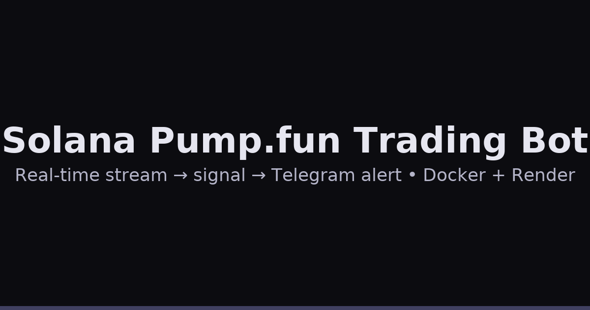

# Solana Pump.fun Trading Bot

A production-ready, open-source bot that monitors a live stream of Solana/Pump.fun trades, detects unusual activity in real time, and sends instant alerts to Telegram. Runs 24/7 in the cloud with self-healing and graceful error handling.

<p align="center">
  
</p>

---

## What it does (plain English)

- **Watches a live data feed** of digital-asset trades happening in milliseconds.
- **Analyzes activity in real time** to flag unusual buy patterns and volume.
- **Sends alerts to Telegram** immediately so users can act within seconds.
- **Stays online 24/7** in the cloud with retry/backoff and health checks.

Think of it like a **stock-market early-warning system**, but tailored for a blockchain environment.

---

## How it works (high level)

1. **Ingestion**: A WebSocket client subscribes to Pump.fun trade events.
2. **Signal**: Lightweight scoring detects bursts/whales/wallet clusters (heuristic and rule-based).
3. **Notify**: Alerts are formatted and delivered to Telegram via Bot API/webhooks.
4. **Reliability**: Exponential backoff, jittered reconnects, and structured logging ensure resilience.
5. **Deploy**: Docker image runs on Render (or any container host) with a single service dyno.

> Primary entry point: `webhook_sniper_bot.py` (rename if your repo differs).

---

## Quick start (local)

```bash
# 1) Clone & enter
git clone <YOUR_FORK_URL>
cd pumpbot

# 2) Create virtual env
python3 -m venv .venv && source .venv/bin/activate  # Windows: .venv\Scripts\activate

# 3) Install deps
pip install -r requirements.txt

# 4) Configure env (copy & edit)
cp .env.example .env

# 5) Run
python webhook_sniper_bot.py
```

---

## Environment variables

Create a `.env` file based on `.env.example`:

- `TELEGRAM_BOT_TOKEN`: Telegram bot token (from @BotFather)
- `TELEGRAM_CHAT_ID`: Chat or channel ID to receive alerts
- `PUMPFUN_WS_URL`: WebSocket endpoint for the Pump.fun stream
- `LOG_LEVEL`: `INFO` (default), `DEBUG`, or `WARNING`
- `HEALTHCHECK_PORT`: Optional HTTP port for liveness checks (defaults to `8080`)

> **Security**: Never commit real secrets. `.env` is git-ignored.

---

## Docker (one-command run)

```bash
# Build
docker build -t pumpbot:latest .

# Run
docker run --rm -it --env-file .env pumpbot:latest
```

---

## Deploy on Render

Add this `render.yaml` to the repo root and create a new **Web Service** on Render:

```yaml
services:
  - type: web
    name: pumpbot
    env: docker
    plan: starter
    autoDeploy: true
    healthCheckPath: /healthz
    envVars:
      - key: TELEGRAM_BOT_TOKEN
        sync: false
      - key: TELEGRAM_CHAT_ID
        sync: false
      - key: PUMPFUN_WS_URL
        sync: false
      - key: LOG_LEVEL
        value: INFO
      - key: HEALTHCHECK_PORT
        value: "8080"
```

> Render will auto-detect the `Dockerfile`. Expose a simple `/healthz` endpoint from your app or keep the port open to allow container start.

---

## Makefile (Developer Experience)

```makefile
.PHONY: run docker-build docker-run fmt

run:
	python webhook_sniper_bot.py

docker-build:
	docker build -t pumpbot:latest .

docker-run:
	docker run --rm -it --env-file .env pumpbot:latest

fmt:
	python -m pip install black && black .
```

---

## Project structure (suggested)

```
pumpbot/
├─ webhook_sniper_bot.py
├─ requirements.txt
├─ Dockerfile
├─ render.yaml
├─ .env.example
├─ .gitignore
├─ LICENSE
├─ Makefile
└─ README.md
```

---

## Contributing

PRs welcome! Please open an issue first to discuss major changes. Keep commits focused and include a brief rationale in the PR description.

---

## License

MIT © 2025 [Your Name]
